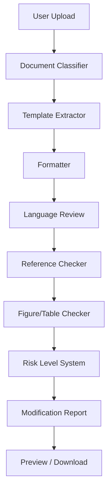

# AI论文格式修改Agent

上传 DOCX -> Agent 自动完成格式修复、参考文献检查、图表检查、风险分析、报告生成、在线预览与下载。

当前定位：`v0.4-beta`，偏格式智能体（Format Agent）。它不是内容生成器，不是查重系统，也不是论文代写工具。

## 项目简介

AI论文格式修改Agent 是一个面向 DOCX 论文和报告文档的本地格式处理系统。用户上传论文后，系统会识别文档类型，按通用论文规则或上传模板进行格式修复，再生成修改报告、风险提示、在线预览和最终 DOCX 下载。

项目当前重点是稳定“格式 Agent”：让标题、正文、页边距、段落缩进、参考文献提示、图表编号提示和报告解释更可靠。AI 语言评分只作为参考信息，不参与最终主评分，也不会拉低格式规则分。

## 技术栈

Backend:

- Python
- FastAPI
- python-docx

Frontend:

- Next.js
- TypeScript

Agent:

- Agent Trace
- Risk Level System
- Reference Checker
- Figure/Table Checker

## 核心功能

- DOCX 上传
- 文档分类
- 模板解析
- 格式修复
- 标题正文混排修复
- 在线预览
- DOCX 下载
- 格式差异报告
- Reference Checker
- Figure/Table Checker
- Risk Level
- Agent Trace

## Agent 工作流



## 本地启动

Backend:

```powershell
cd D:\ai_论文修改格式\paper-ai\backend
python -m venv .venv
.\.venv\Scripts\Activate.ps1
pip install -r requirements.txt
uvicorn main:app --reload --host 127.0.0.1 --port 8000
```

Frontend:

```powershell
cd D:\ai_论文修改格式\paper-ai\frontend
npm install
npm run dev
```

访问：

- Backend health: `http://127.0.0.1:8000/health`
- Frontend: `http://127.0.0.1:3000`

Test:

```powershell
cd D:\ai_论文修改格式\paper-ai\backend
python -m py_compile main.py services\paper_agent.py services\docx_analyzer.py services\docx_formatter.py services\preview_service.py
python test_smoke_agent_flow.py
python test_reference_checker.py
python test_figure_table_checker.py
python test_agent_orchestrator_trace.py
python test_risk_level_system.py
python test_score_consistency.py

cd D:\ai_论文修改格式\paper-ai\frontend
npm run build
```

AI 模式可选环境变量：

```powershell
cd D:\ai_论文修改格式\paper-ai\backend
copy .env.example .env
```

未配置 API Key 时，AI 语言审校会降级到本地规则，不应中断主流程。

## 真实DOCX回归结果

真实样本目录：`paper-ai/backend/test_documents/real/`

回归结果目录：`paper-ai/backend/regression_results/`

最近真实 DOCX 回归：

- 样本：10
- PASS：10
- FAIL：0
- PASS率：100%
- `manual_review_required`：10/10 -> 1/10

风险汇总：

- blocking：0
- high_risk：2
- warning：10
- info：13

回归结果文件：

- `paper-ai/backend/regression_results/summary.csv`
- `paper-ai/backend/regression_results/summary.json`
- `paper-ai/backend/test_documents/real/real_document_inventory.md`

## 当前限制

- 不是知网查重、维普查重或万方查重，只提供重复风险检测和相似度预检。
- 不是内容生成器，不承诺自动补写论文观点、实验结果或参考文献。
- 不是论文代写工具，不替代作者的学术判断和人工复核。
- 复杂 Word 对象支持有限，包括目录、脚注、批注、公式、页眉页脚、图片题注和复杂表格。
- Preview 不是 Word 像素级还原，只用于在线快速阅读和结构确认。
- AI 语言评分仅作参考，不参与主评分计算。

## 版本路线图

- `v0.2-format-core-pass`：格式核心链路通过，上传、格式修复、预览、下载和 smoke test 可用。
- `v0.3.1-format-diff-report`：增强格式差异报告，新增改了什么和仍需复查的字段。
- `v0.3.2-online-preview`：优化在线预览，增强标题、正文、参考文献和表格展示。
- `v0.3.3-reference-checker`：新增 Reference Checker，检查参考文献章节、编号、引用缺失和未引用文献。
- `v0.3.4-figure-table-checker`：新增 Figure/Table Checker，检查图表编号连续性、重复编号和正文引用缺失。
- `v0.3.5-test-corpus-structure`：建立测试文档目录、manifest 和真实论文测试计划。
- `v0.3.5-test-corpus-samples`：生成 10 个脱敏 DOCX 测试样本。
- `v0.3.6-inline-heading-fix`：修复标题正文混排，包括段落开头和段落中间标题。
- `v0.3.6-real-document-collection`：收集 10 个公开 DOCX 真实样本并整理来源清单。
- `v0.3.7-agent-orchestrator-trace`：新增 Agent Trace，记录执行计划、工具调用、决策和 fallback。
- `v0.3.8-real-document-regression`：对真实 DOCX 执行回归，10/10 PASS。
- `v0.3.9-risk-level-system`：新增 Risk Level System，将人工复查从提示项中分离。
- `v0.4.1-scoring-semantics`：重构评分语义，明确格式规则分、风险稳定分、AI语言参考分和最终评分。

## 文档

- [架构说明](docs/ARCHITECTURE.md)
- [Agent Trace](docs/AGENT_TRACE.md)
- [Risk Level System](docs/RISK_LEVEL_SYSTEM.md)
- [真实回归结果](docs/REGRESSION_RESULTS.md)
- [部署规划](docs/DEPLOYMENT_PLAN.md)
