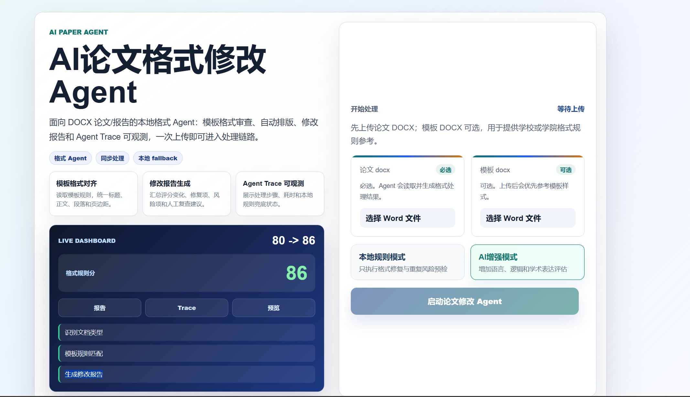

# AI论文格式修改 Agent

这是一个面向 DOCX 论文/报告的 AI 文档格式处理应用，支持格式检测、模板适配、修改报告、重复风险预检、参考文献/图表检查、Agent 执行轨迹、在线预览和 DOCX 下载。



Demo 页面展示：文档上传、处理结果、修改报告与 Agent Trace。

## 项目定位

本项目定位为论文格式处理 Agent / AI 文档处理应用，重点是把 DOCX 文档处理流程做成一个可运行、可解释、可展示的工程闭环。

- 不是论文代写工具，不生成论文观点、实验结果或参考文献正文。
- 不是正式查重系统，只做重复风险预检和相似度风险提示。
- 不承诺保证通过学校格式检查，最终提交前仍建议人工复核。
- AI 主要用于语言审校建议和辅助评分。
- 核心能力是格式修复、检查报告和可解释处理流程。

## 当前版本

- 推荐查看：`main` 分支。
- 稳定展示基线：`v1.0-showcase`。
- `v1.0-showcase` 指向：`10904db222c3894103e6cfe2aaf5ced79d372122`。
- `main` 分支包含 `v1.0-showcase` 之后的面试材料补充和公开前清理。
- 历史版本文档和受控试用资料已归档至 `docs/archive/`。

## 项目亮点

- `FastAPI` + `Next.js` 完整应用闭环。
- DOCX 上传、Agent 处理、在线预览、最终 DOCX 下载。
- `local` / `ai` 双模式，支持无 API Key 的本地演示。
- AI 不可用时 `Fallback` 到本地规则，不中断主流程。
- `agent_trace` 记录可解释执行轨迹。
- `modification_report` 输出修改报告、评分变化和人工复查项。
- `reference_check` / `figure_table_check` 检查参考文献和图表编号风险。
- 已通过 `Smoke Test`、`agent_trace` test 和前端 build 验证。

## 技术栈

Backend:

- `Python`
- `FastAPI`
- `python-docx`

Frontend:

- `Next.js`
- `React`
- `TypeScript`

AI 应用:

- `LLM API`
- `Prompt`
- `Agent Workflow`
- `Fallback`

工程化:

- `Git`
- `Smoke Test`
- `regression docs`
- `Git Tag`

## 快速开始

Backend:

```powershell
cd paper-ai/backend
python -m venv .venv
.\.venv\Scripts\Activate.ps1
pip install -r requirements.txt
uvicorn main:app --reload --host 127.0.0.1 --port 8000
```

Frontend:

```powershell
cd paper-ai/frontend
npm install
npm run dev
```

访问地址：

- Backend health: `http://127.0.0.1:8000/health`
- Frontend: `http://127.0.0.1:3000`

## 环境变量

后端可复制示例环境变量文件：

```powershell
cd paper-ai/backend
copy .env.example .env
```

前端可配置后端 API 地址：

```powershell
$env:NEXT_PUBLIC_API_BASE_URL="http://127.0.0.1:8000"
```

没有 API Key 时，可以使用 `local` 模式、`Fallback` 流程和内置 demo 样本完成演示。

## Docker部署

环境要求：Docker Engine 或 Docker Desktop，以及 Docker Compose v2。安装方式见 [Docker Desktop](https://docs.docker.com/desktop/) 或 [Docker Engine](https://docs.docker.com/engine/install/) 官方文档。

先准备后端环境变量：

```powershell
Copy-Item paper-ai/backend/.env.example paper-ai/backend/.env
```

没有 API Key 时可留空并使用 `local` 模式。`.env` 不会进入 Git 或 Docker 镜像构建上下文。

在项目根目录一键启动：

```powershell
docker compose up --build
```

访问地址：

- Frontend: `http://localhost:3000`
- Backend health: `http://localhost:8000/health`

安全检查 Compose 配置：

```powershell
docker compose config --quiet
```

常见问题：前端 API 地址使用 `NEXT_PUBLIC_API_BASE_URL` 在构建时注入，修改后需重新构建；容器中的 `127.0.0.1` 不代表宿主机。服务器 IP/Domain 的 CORS 限制、代理和数据持久化说明见 [Docker 部署文档](docs/DOCKER_DEPLOYMENT.md)。

## 最小可复现测试

Backend:

```powershell
cd paper-ai/backend
python test_agent_orchestrator_trace.py
python test_smoke_agent_flow.py
```

Frontend:

```powershell
cd ../frontend
npm run build
```

`manifest.csv`、`generated_manifest.csv`、`heavy_manifest.csv` 对应的完整 DOCX 回归样本属于本地脱敏样本和压力测试资产，不全部随公开仓库发布。完整 manifest / heavy 回归不是公开 clone 后的默认必跑流程。

## Demo 材料

- [面试演示包](docs/INTERVIEW_DEMO_PACKAGE.md)
- [演示脚本](docs/DEMO_SCRIPT.md)
- [固定演示案例](docs/DEMO_CASE.md)
- [Demo 运行结果](docs/DEMO_RESULT.md)
- [v1.0-showcase 摘要](docs/V1_0_SHOWCASE_SUMMARY.md)

## 项目限制

- 不是正式查重系统。
- 不是论文代写工具。
- 在线预览不是 Word 像素级还原。
- 复杂 Word 对象支持有限，例如目录、脚注、批注、公式、页眉页脚和复杂图文排版。
- 当前不是完整异步队列、多用户系统或云端生产部署方案。

## License

MIT License
