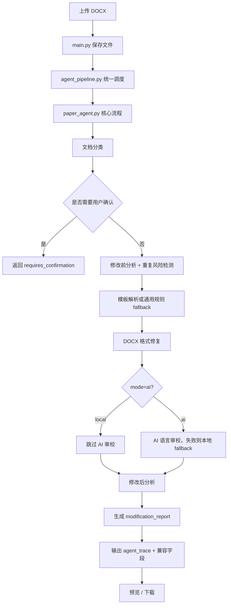

# AI论文格式修改Agent

当前版本：`v0.8.2-trace-ui-polish`

这是一个面向 DOCX 论文/报告的本地格式处理 Agent。用户上传论文后，系统会完成文档分类、格式修复、模板规则适配、重复风险检测、参考文献检查、图表编号检查、修改报告生成、在线预览和最终 DOCX 下载。

项目当前定位是“论文格式 Agent”，不是论文代写工具、不是正式查重系统，也不是深度内容润色系统，也不是完整工业级 Agent。AI 模式目前主要用于语言审校建议和参考评分；核心稳定能力仍是格式修复、检查报告和可解释处理流程。

## 项目亮点

- 完整主链路：上传 DOCX -> Agent 处理 -> 在线预览 -> 下载结果文件。
- 统一调度层：`agent_pipeline.py` 负责包装 `/agent/run` 主流程，统一输出展示用 `agent_trace`。
- 可解释 Trace：每一步记录 `step`、`status`、`duration_ms`、`fallback_used`、`message`。
- 前端 Trace 展示：结果页可默认折叠展示 `agent_trace` 步骤列表，并展示 `task_id` / `task_state_path` 任务状态摘要；v0.8.2 已优化步骤文案、fallback 提示和缺字段保护。
- 任务状态落盘：每次 Agent Pipeline 运行会生成 `task_id`，并写入 `task_state.json`，记录 running/succeeded/failed 生命周期状态。
- fallback 保护：未上传模板、AI 调用失败、相似度预检异常等场景不会轻易中断主流程。
- 旧字段兼容：保留 `modification_report`、`reference_check`、`figure_table_check` 等原有字段，降低前端和测试回归风险。
- 测试覆盖：包含 smoke test、评分一致性、参考文献检查、图表编号检查、风险等级和 trace 结构测试。

## 技术栈

Backend:

- Python
- FastAPI
- python-docx
- TestClient / 独立测试脚本

Frontend:

- Next.js
- React
- TypeScript

Agent 相关实现:

- `agent_pipeline.py`：统一调度层
- `paper_agent.py`：核心处理流程
- `agent_orchestrator.py`：解释型 trace 细节
- `docx_formatter.py`：DOCX 格式修复
- `docx_analyzer.py`：评分、参考文献、图表编号检查
- `language_reviewer.py`：AI/本地语言审校 fallback
- `plagiarism_checker.py`：重复风险检测 / 相似度预检

未使用或未实现：

- 未接入 RAG、LangGraph、Milvus、数据库、用户系统或云部署。
- 未实现论文正文生成、论文代写、正式查重。

## 核心功能

- DOCX 论文上传。
- 可选 DOCX 模板上传。
- 文档类型识别：标准论文、课程作业、实验报告、简历、未知文档。
- 非标准论文确认机制。
- 标题、正文、段落、页边距等基础格式修复。
- 标题正文混排拆分。
- 部分异常模板残留清理，例如 smoke test 覆盖的 `C-51`。
- 参考文献基础检查。
- 图表编号和正文引用检查。
- 重复风险检测 / 相似度预检。
- local 模式：本地格式规则，不启用 AI 评分。
- ai 模式：在格式修复基础上尝试 AI 语言审校，失败时 fallback 到本地规则。
- 修改报告：包含修复项、评分对比、自动处理数量、人工复查建议。
- 在线 HTML 预览。
- 最终 DOCX 下载。

## 处理流程



## 返回字段说明

`/agent/run` 保留旧字段：

- `status`
- `mode`
- `steps`
- `before_score`
- `after_score`
- `score_breakdown`
- `repeat_risk`
- `download_url`
- `filename`
- `before_analysis`
- `after_analysis`
- `modification_report`
- `language_review`
- `reference_check`
- `figure_table_check`

展示版新增/规范化：

- `agent_trace`：逐步列表，每项包含 `step`、`status`、`duration_ms`、`fallback_used`、`message`。
- `agent_trace_detail`：保留旧解释型 trace，包含任务计划、工具调用、fallback 原因、人工复查判断和置信度。
- `task_id`：本次 Agent 运行的任务 ID。
- `task_state_path`：本次任务状态 JSON 的落盘路径。

前端展示说明：
- v0.8.1 起，结果页会默认折叠展示 `agent_trace` 的步骤、状态、消息、耗时和 fallback 标记。
- v0.8.2 起，TracePanel 文案更明确：fallback 会显示为本地规则兜底，不会被表述为严重失败；缺失消息或耗时时会使用温和默认值。
- 结果页会展示 `task_id` 和 `task_state_path` 摘要，`task_state_path` 仅表示后端本地运行产物路径，用于开发/演示排查，不代表异步队列或任务恢复能力。
- 前端不会读取 `task_state_path` 对应文件内容，也不会展示 `agent_trace_detail`。
- 当前仍不是异步队列，也不是完整断点续跑或完整工业级 Agent。

Task State 说明：

- 默认写入 `paper-ai/backend/task_states/{task_id}.json`。
- `task_state` 是任务状态持久化雏形，描述任务生命周期，例如 `running`、`succeeded`、`failed`。
- 记录字段包括 `status`、`input_files`、`output_files`、`duration_ms`、`fallback_used`、`error`、评分摘要和 `agent_trace_steps_count`。
- `agent_trace` 描述处理步骤，例如分类、模板解析、格式修复、AI 审校、复查和报告生成。
- `task_state` 描述任务生命周期，例如何时开始、是否成功、总耗时、输入输出文件和错误信息；两者不互相替代。
- 当前版本不是异步队列，也不是完整断点续跑。

## 启动方式

Backend:

```powershell
cd D:\ai_论文修改格式\paper-ai\backend
python -m venv .venv
.\.venv\Scripts\Activate.ps1
pip install -r requirements.txt
uvicorn main:app --reload --host 127.0.0.1 --port 8000
```

Frontend:

```powershell
cd D:\ai_论文修改格式\paper-ai\frontend
npm install
npm run dev
```

访问：

- Backend health: `http://127.0.0.1:8000/health`
- Frontend: `http://127.0.0.1:3000`

AI 模式可选配置：

```powershell
cd D:\ai_论文修改格式\paper-ai\backend
copy .env.example .env
```

未配置 API Key 或 LLM 调用失败时，系统会降级到本地语言规则，不应中断主流程。

## 测试命令

后端语法检查：

```powershell
cd D:\ai_论文修改格式
python -m py_compile .\paper-ai\backend\main.py .\paper-ai\backend\services\agent_pipeline.py .\paper-ai\backend\services\paper_agent.py .\paper-ai\backend\services\agent_orchestrator.py .\paper-ai\backend\services\document_classifier.py .\paper-ai\backend\services\docx_analyzer.py .\paper-ai\backend\services\docx_formatter.py .\paper-ai\backend\services\language_reviewer.py .\paper-ai\backend\services\plagiarism_checker.py .\paper-ai\backend\services\preview_service.py .\paper-ai\backend\services\template_extractor.py
```

后端测试：

```powershell
cd D:\ai_论文修改格式\paper-ai\backend
python test_reference_checker.py
python test_figure_table_checker.py
python test_risk_level_system.py
python test_composite_numbering.py
python test_formatter_mixed_heading.py
python test_score_consistency.py
python test_agent_orchestrator_trace.py
python test_smoke_agent_flow.py
```

前端构建：

```powershell
cd D:\ai_论文修改格式\paper-ai\frontend
npm run build
```

## 展示时建议强调

- 我把论文处理拆成了稳定的工程工具链，而不是让 LLM 自由决定流程。
- `agent_pipeline.py` 是 API 和核心处理流程之间的统一调度层。
- `agent_trace` 让每一步处理可解释、可展示、可测试。
- local 模式和 ai fallback 都有明确规则，AI 失败不会拖垮主流程。
- 旧字段兼容是为了保护已有前端和测试。
- 当前能力边界清楚：主要做格式处理和风险提示，不承诺深度内容改写。

## 当前限制

- 重复风险检测 / 相似度预检不等同于正式查重系统。
- AI 语言评分只作参考，不参与主评分计算，也不会拉低最终格式评分。
- 复杂 Word 对象支持有限，例如目录、脚注、批注、公式、页眉页脚和复杂图文排版。
- 在线预览不是 Word 像素级还原，只用于快速检查结构和内容。
- 内容级 Agent 仍在规划中，当前不会自动补写论文观点、实验结果或参考文献。
- `task_state` 当前只是运行状态持久化雏形，还没有清理策略、前端可视化或断点续跑能力。

## Task State / 任务状态

v0.7.0 引入了最小任务状态持久化能力，v0.7.1 对文档说明进行了同步。它的目标是提升可观测性，而不是改变主流程。

- 每次 `run_agent_pipeline(...)` 运行都会生成一个 `task_id`。
- 状态文件默认写入 `paper-ai/backend/task_states/{task_id}.json`。
- `paper-ai/backend/task_states/` 是运行产物目录，已通过 `.gitignore` 忽略，不应提交到 Git。
- `demo_outputs/task_state_sample.json` 是固定演示样例，可以提交；它和运行时生成的 `task_states/{task_id}.json` 用途不同。
- `/agent/run` 仍保持同步返回，只额外透出 `task_id` 和 `task_state_path`。
- `task_state` 记录任务生命周期：输入文件、输出文件、运行状态、总耗时、fallback 概览和错误信息。
- `agent_trace` 记录处理步骤：分类、读取、分析、模板、格式修复、AI 审校、重复风险预检、最终复查和报告生成。
- `demo_outputs/task_state_sample.json` 是 v0.7.2 固定 demo 样例，用于展示任务状态持久化结果结构。
- v0.8.1 已在前端结果页展示 `agent_trace` 折叠列表和 `task_id` / `task_state_path` 摘要；v0.8.2 对展示文案、fallback 状态和 task state 摘要边界做了小范围打磨，但仍没有读取 task state 文件内容。
- 当前没有实现任务队列、后台异步执行、完整 task state 文件内容可视化或完整断点续跑；也没有自动清理函数，后续可单独补充轻量清理命令。

## Demo Samples / 演示样本

v0.6.3 增加了一组可用于面试演示的人工构造脱敏模拟 DOCX 输入样本、模板样本，以及一次 local 模式真实运行输出。

- `demo_inputs/`
  - `messy_paper_sample.docx`：模拟论文输入样本，标题为“基于传感器数据分析的健康风险快速检测方法研究”。
  - `template_sample.docx`：模板样式示例，包含一级标题、二级标题、正文、摘要、参考文献、图题和表题样式。
  - 样本内容是人工构造的脱敏模拟文本，不来自真实用户论文，也不来自 CAJ 原文。
- `demo_outputs/`
  - `formatted_result_sample.docx`：使用当前 local 模式流程生成的格式处理结果。
  - `report_sample.json`：本次运行报告样例。
  - `agent_trace_sample.json`：本次运行的逐步 Agent Trace。
  - `task_state_sample.json`：固定 task state 样例，用于展示任务生命周期状态结构，不代表真实用户论文任务。
- `docs/DEMO_CASE.md`
  - 固定演示案例说明，描述样本特征、处理流程、重点观察字段和面试讲解话术。
- `docs/DEMO_RESULT.md`
  - 记录 demo 输入/输出文件、故意设置的格式问题、运行方式、report/trace/task state 重点字段、限制和验收情况。

本轮未修改核心业务逻辑、前端交互、测试断言或依赖文件。DOCX 渲染截图验收因当前环境缺少 LibreOffice/`soffice` 跳过；DOCX 结构检查和 local Agent 处理流程已通过。

## 相关文档

- [架构说明](docs/ARCHITECTURE.md)
- [固定演示案例](docs/DEMO_CASE.md)
- [Demo 运行结果](docs/DEMO_RESULT.md)
- [面试演示脚本](docs/DEMO_SCRIPT.md)
- [面试问答](docs/INTERVIEW_QA.md)
- [开发记录](docs/DEVELOPMENT_LOG.md)
- [Agent Trace](docs/AGENT_TRACE.md)
- [Risk Level System](docs/RISK_LEVEL_SYSTEM.md)
- [真实回归结果](docs/REGRESSION_RESULTS.md)
- [部署规划](docs/DEPLOYMENT_PLAN.md)
