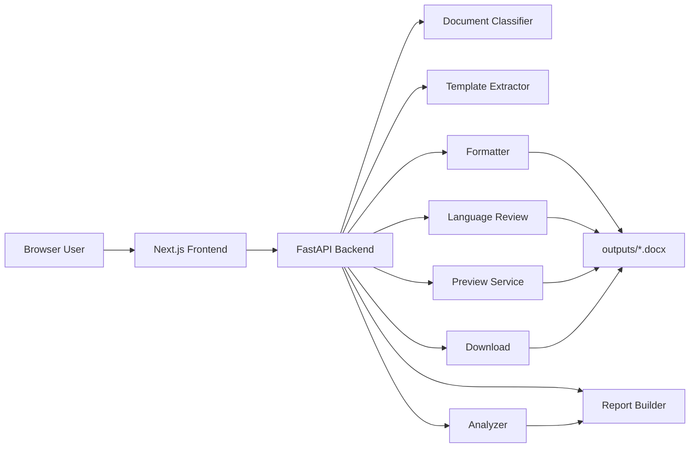

# Architecture

本文档说明 AI论文格式修改Agent 的 v0.4-beta 架构。当前项目以格式智能体为主，核心目标是稳定 DOCX 格式处理链路，并用报告、风险等级和 Agent Trace 解释处理过程。

## 总体架构

## 前端结构

位置：`paper-ai/frontend/`

- `app/page.tsx`：主页面，负责文件上传、模式选择、启动 Agent、展示执行步骤、评分、报告、风险、预览和下载入口。
- `app/globals.css`：页面样式，包含上传区、结果区、报告区、预览区和评分卡片样式。
- `package.json`：Next.js 项目脚本和依赖。

前端不直接处理 DOCX 内容，只调用后端 API，并展示后端返回的结构化结果。

## 后端结构

位置：`paper-ai/backend/`

- `main.py`：FastAPI 入口，负责路由、上传文件保存、Agent 调用、预览和下载。
- `services/paper_agent.py`：Agent 主编排流程，串联分类、分析、模板解析、格式修复、语言审校、风险预检、最终分析和报告生成。
- `services/agent_orchestrator.py`：生成 `agent_trace`，解释工程执行轨迹。

## Agent工具链

当前 Agent 使用明确的工具链，而不是让 LLM 自由决定流程。

- 文档分类工具：`document_classifier.classify_document`
- 模板解析工具：`template_extractor.extract_template_profile`
- 格式修复工具：`docx_formatter.apply_paper_format`
- 文档分析工具：`docx_analyzer.analyze_docx`
- 语言审校工具：`language_reviewer.review_language_with_status`
- 重复风险预检：`plagiarism_checker.check_repeat_risk`
- 报告生成：`paper_agent.build_modification_report`
- 在线预览：`preview_service.build_preview`
- 下载：`main.py` 的 `/download/{filename}` 路由

## Formatter

位置：`paper-ai/backend/services/docx_formatter.py`

Formatter 负责对 Word 文档做实际修改，包括：

- 标题层级与样式
- 正文字体与段落格式
- 行距、缩进、页边距
- 标题正文混排拆分
- 部分模板残留清理

v0.4-beta 文档整理不修改 formatter。

## Analyzer

位置：`paper-ai/backend/services/docx_analyzer.py`

Analyzer 负责计算分析结果和评分结构，包括：

- 格式规则评分
- 参考文献检查
- 图表编号检查
- Risk Level 汇总
- `score_breakdown`

`score_breakdown` 当前包含格式规则分、风险稳定分、AI语言参考分、最终评分和评分解释。

## Report

位置：`paper-ai/backend/services/paper_agent.py`

报告生成逻辑输出：

- `format_diff_summary`
- `changed_dimensions`
- `score_delta_by_dimension`
- `manual_review_items`
- `warning_items`
- `info_items`
- `risk_summary`
- `score_explanation`

报告用于说明“改了什么”和“仍需人工复查什么”。

## Preview

位置：`paper-ai/backend/services/preview_service.py`

Preview 将最终 DOCX 转为 HTML 预览，增强：

- 标题层级
- 正文段落缩进与行距
- 参考文献区域展示
- 表格基础样式

Preview 不是 Word 像素级还原，只用于快速在线检查。

## Download

下载由 FastAPI 路由提供：

- `GET /download/{filename}`

下载文件来自 `paper-ai/backend/outputs/`。该目录用于运行产物，不应作为业务源码提交。
