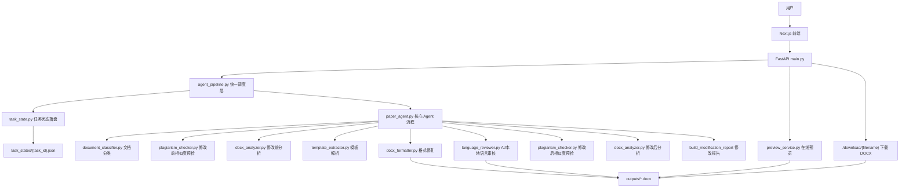
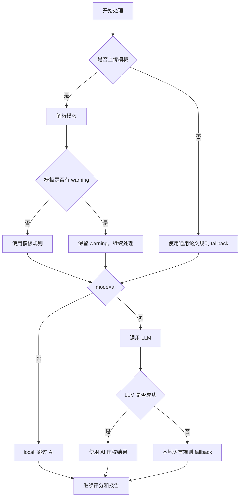

# 系统架构说明

版本：`v0.7.3-task-state-cleanup`

本文档说明 AI论文格式修改Agent 的现有架构。当前系统以 DOCX 论文格式处理为主，通过 FastAPI + Next.js 提供上传、预览和下载，通过后端工具链完成分类、格式修复、检查、评分和报告生成。

本文档只描述已经实现的内容，不包含未接入的 RAG、LangGraph、Milvus、数据库、用户系统或云部署。

## 总体架构



## 分层职责

### 前端层

位置：`paper-ai/frontend/`

- 负责上传论文和可选模板。
- 选择 `local` 或 `ai` 模式。
- 展示执行步骤、评分、修改报告、重复风险提示、参考文献检查、图表编号检查。
- 调用预览接口展示最终 DOCX 的 HTML 预览。
- 提供下载入口。

前端不直接解析或修改 DOCX。

### API 层

位置：`paper-ai/backend/main.py`

- `GET /health`：健康检查。
- `POST /document/classify`：上传 DOCX 并识别文档类型。
- `POST /agent/run`：保存上传文件，调用 `run_agent_pipeline(...)`。
- `GET /preview/{filename}`：读取输出 DOCX，生成 HTML 预览。
- `GET /download/{filename}`：下载输出 DOCX。

API 层不承载复杂业务规则，主要负责文件保存、路由和响应。

### 统一调度层

位置：`paper-ai/backend/services/agent_pipeline.py`

`agent_pipeline.py` 是 `/agent/run` 与核心 Agent 之间的薄调度层。它不重写核心业务流程，主要做三件事：

- 调用 `paper_agent.run_paper_agent(...)`。
- 将旧的解释型 trace 保留为 `agent_trace_detail`。
- 将展示用 `agent_trace` 标准化为逐步列表。
- 调用 `task_state.py` 写入任务生命周期状态。

标准化后的 `agent_trace` 每项包含：

```json
{
  "step": "识别文档类型",
  "status": "ok",
  "duration_ms": 12,
  "fallback_used": false,
  "message": "文档类型：标准论文，置信度 95%。"
}
```

这个设计的目的不是引入复杂框架，而是让处理过程更容易在面试、调试和测试中解释。

### 任务状态层

位置：`paper-ai/backend/services/task_state.py`

`task_state.py` 是 v0.7.0 新增的最小状态持久化工具。它不参与 DOCX 格式修复，不替代核心 Agent，也不把 `/agent/run` 改成异步队列。

当前行为：

- `agent_pipeline.py` 在每次运行开始时生成 `task_id`。
- task state 默认写入 `paper-ai/backend/task_states/{task_id}.json`。
- `paper-ai/backend/task_states/` 属于运行产物目录，已通过 `.gitignore` 忽略，不应提交到 Git。
- `demo_outputs/task_state_sample.json` 属于固定演示样例，用于面试展示字段结构；它不是运行时 task state 目录。
- pipeline 开始时写入 `running`，成功时写入 `succeeded`，异常或内部错误时写入 `failed`。
- `/agent/run` 仍同步返回，旧字段保持兼容，只额外透出 `task_id` 和 `task_state_path`。

task state 重点字段包括：

- `task_id`
- `status`
- `mode`
- `created_at` / `updated_at` / `started_at` / `finished_at`
- `duration_ms`
- `input_files`
- `output_files`
- `classification`
- `before_score` / `after_score`
- `ai_used` / `ai_score`
- `fallback_used`
- `error`
- `agent_trace_steps_count`

边界说明：

- `task_state` 记录任务生命周期。
- `agent_trace` 记录处理步骤。
- `task_states/{task_id}.json` 是运行时产物，`demo_outputs/task_state_sample.json` 是固定 demo 样例，两者不能混淆。
- `modification_report` 记录格式修复、评分变化和人工复查建议。
- `reference_check` / `figure_table_check` 记录专项检查结果。

这几个字段各自承担不同职责，`task_state` 不替代 `modification_report`、`reference_check`、`figure_table_check` 或 `agent_trace`。

### 核心 Agent 流程

位置：`paper-ai/backend/services/paper_agent.py`

核心流程顺序如下：

1. `classify_document(...)` 识别文档类型。
2. 如果是非标准论文且未确认，返回 `requires_confirmation`。
3. 修改前执行重复风险检测和格式分析。
4. 解析上传模板；没有模板时使用通用论文规则。
5. `apply_paper_format(...)` 修改 DOCX 格式。
6. `local` 模式跳过 AI；`ai` 模式尝试语言审校。
7. AI 调用失败时 fallback 到本地语言规则。
8. 修改后再次做重复风险检测和评分分析。
9. 构建 `modification_report`。
10. 返回结果、下载文件名、报告、trace 和兼容字段。

## agent_trace 与 agent_trace_detail

当前系统有两层 trace：

- `agent_trace`：展示版逐步列表，适合前端展示和面试说明。
- `agent_trace_detail`：旧解释型对象，保留任务计划、工具调用、Agent 决策、fallback 原因、人工复查判断和置信度。
- `task_state`：任务生命周期 JSON，适合查看任务是否运行中、成功、失败、耗时和输入输出文件。

这样做的原因：

- 新 trace 对面试展示更直观。
- 旧 trace 对调试和已有测试仍有价值。
- 不删除旧结构，降低兼容风险。

## local / ai 模式

### local 模式

local 模式只依赖本地规则：

- 执行文档分类。
- 执行格式修复。
- 执行重复风险检测 / 相似度预检。
- 执行参考文献和图表编号检查。
- 生成修改报告。
- 不启用 AI 语言评分。

必须满足：

- `ai_score = null`
- `ai_used = false`

### ai 模式

ai 模式在 local 格式修复基础上尝试语言审校：

- 如果 LLM 调用成功，返回 AI 语言参考评分和建议。
- 如果 LLM 调用失败，fallback 到本地语言规则。
- AI 语言评分只作参考，不参与主评分计算。
- AI 失败不应中断主流程。

## fallback 策略



已实现 fallback 场景：

- 未上传模板：通用论文规则。
- 模板解析 warning：记录 warning，继续处理。
- local 模式：明确跳过 AI。
- ai 模式 LLM 失败：本地规则 fallback。
- 重复风险检测异常：返回占位低风险结果，主流程继续。
- 非标准论文：返回 `requires_confirmation`，由用户确认后继续。

## 旧字段兼容

为了保持前端和测试稳定，结果中继续保留：

- `steps`
- `before_score`
- `after_score`
- `score_breakdown`
- `repeat_risk`
- `download_url`
- `filename`
- `before_analysis`
- `after_analysis`
- `modification_report`
- `language_review`
- `reference_check`
- `figure_table_check`

其中 `reference_check` 和 `figure_table_check` 既保留在 `after_analysis` 中，也同步到顶层，便于旧代码读取。

## 测试覆盖

现有测试重点覆盖：

- 参考文献检查：`test_reference_checker.py`
- 图表编号检查：`test_figure_table_checker.py`
- 风险等级：`test_risk_level_system.py`
- 复合编号：`test_composite_numbering.py`
- 标题正文混排：`test_formatter_mixed_heading.py`
- 评分语义和 AI 分数不拉低最终分：`test_score_consistency.py`
- 旧解释型 trace：`test_agent_orchestrator_trace.py`
- 上传处理主流程、模板、local、ai fallback、预览、下载、新 `agent_trace`：`test_smoke_agent_flow.py`

## 设计取舍

- 选择显式工具链，而不是让 LLM 自由决定处理流程。
- 选择薄调度层，而不是引入大型编排框架。
- 选择保留旧字段，而不是一次性调整前后端协议。
- 选择让 AI 失败 fallback，而不是把 AI 失败暴露为用户主流程失败。
- 选择先做最小 task state 落盘，而不是直接引入异步队列或断点续跑。
- 选择明确产品边界：当前主要是格式 Agent，不夸大为深度内容改写 Agent。
