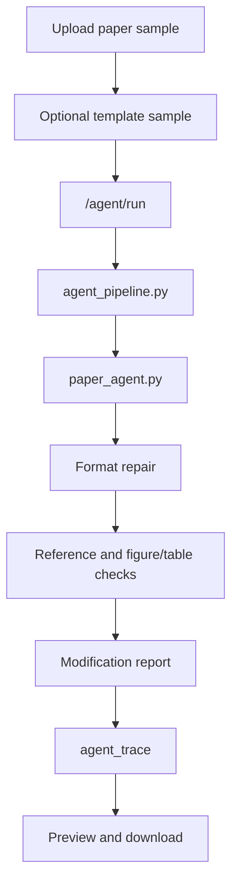

# Fixed Demo Case

Version: `v0.9.3-interview-demo-package`

This document describes the fixed interview demo case for the AI Paper Formatting Agent. Starting from `v0.6.3-real-demo-files`, the repository includes an artificial de-identified DOCX paper sample, a DOCX template sample, and one local-mode output set. Starting from `v0.7.2-task-state-sample`, the fixed demo output set also includes a task state JSON sample.

Current stable demo baseline: tag `v1.0-showcase`, pointing to commit `10904db`. The `main` branch contains post-tag interview material and public-readiness documentation updates; those updates do not move the `v1.0-showcase` tag.

## Demo Goal

Show the complete closed loop of the paper formatting Agent:

```text
upload -> agent_pipeline -> format/check/report -> output
```

The demo should make it clear that the project can:

- upload a DOCX paper sample;
- optionally upload a DOCX template sample;
- run the Agent through `agent_pipeline`;
- produce format/check/report results;
- expose `agent_trace`;
- expose a fixed `task_state` sample for lifecycle-state explanation;
- preview and download the generated document.

## Input Sample Description

Built-in input paths:

- Paper sample: `demo_inputs/messy_paper_sample.docx`
- Template sample: `demo_inputs/template_sample.docx`

For browser automation on Windows, it is safer to copy the same files to an ASCII-only temporary path such as `C:\Temp\paper-ai-demo\`. This avoids CDP file-handle issues seen with Chinese workspace paths. The repository demo files remain the source of truth.

These files are artificial demo samples. They do not come from real user papers, do not come from CAJ source text, and should not be described as user-submitted research.

Boundary statement:

- The input DOCX files are manually constructed de-identified simulation samples.
- They are not real user papers and do not reuse CAJ original text.
- They are not for paper ghostwriting or content generation.
- They are only used to demonstrate the engineering loop for format checking, automatic formatting, `report`, `agent_trace`, and `task_state`.

### Paper Sample Should Show

The paper sample is de-identified simulated text and small enough for a live demo. It includes:

- inconsistent heading formats;
- body indentation or line spacing that needs cleanup;
- a cover page, Chinese abstract, English abstract, keywords, 5 body sections, figure/table captions, and references;
- a reference numbering checkpoint;
- a figure numbering/reference checkpoint;
- enough normal paper structure to be recognized as an academic paper.

### Template Sample Should Show

The template sample is simple and can be used to show:

- optional template upload;
- how the system attempts template parsing;
- how the system can continue with fallback/default rules when template information is incomplete.

## Recommended Sample Features

Use a sample that includes several of these issues:

- title formats are inconsistent;
- body indentation or line spacing is not standard;
- reference numbering or citation has a checkable point;
- figure/table numbering has a checkable point;
- the document is still close enough to a real paper that classification can reasonably pass.

Avoid using:

- private or sensitive papers;
- final official submission papers;
- copyrighted full papers without permission;
- files that are too large for a short interview demo.

## Processing Flow



## Key Outputs to Observe

During the demo, focus on these fields:

- `modification_report`
  - Explains what was automatically handled and what still needs manual review.
- `reference_check`
  - Shows reference section and citation checkpoints.
- `figure_table_check`
  - Shows figure/table numbering and reference checkpoints.
- `agent_trace`
  - Shows step, status, duration, fallback usage, and message.
- `task_state`
  - Shows task lifecycle fields such as status, input files, output files, total duration, fallback summary, and trace step count.
- `before_score` / `after_score`
  - Shows the score before and after processing.

For the current recommended local-mode demo, the key score change is `80 -> 86`, and the TracePanel shows 9 execution steps.

Generated output paths from the v0.6.3 local run:

- `demo_outputs/formatted_result_sample.docx`
- `demo_outputs/report_sample.json`
- `demo_outputs/agent_trace_sample.json`
- `demo_outputs/task_state_sample.json`

The DOCX, report, and agent trace output files were generated by direct local-mode invocation of the existing `run_agent_pipeline(...)` flow. `task_state_sample.json` is a fixed v0.7.2 demo sample derived from the current report and trace files to show the task state structure. See `docs/DEMO_RESULT.md` for the exact run result and limitations.

## One-Minute Interview Talk Track

> This demo shows the full loop of my paper formatting Agent. I upload a DOCX paper, optionally upload a template, and the backend routes the task through `agent_pipeline`. The core Agent then classifies the document, repairs formatting, checks references and figure/table numbering, runs local or AI-assisted review with fallback, and returns a structured report. The important part is that the result is not a black box: `agent_trace` records each step, status, duration, fallback usage, and message. The project is intentionally positioned as a formatting Agent, not a paper-writing or formal plagiarism-checking system.

## Current Limitations

- The input sample is artificial simulated text, not a real user paper and not CAJ original text.
- Current AI mode is still a language-review enhancement; it is not deep content rewriting.
- Similarity checking is only duplicate risk detection / similarity pre-check, not formal plagiarism checking.
- `task_state_sample.json` is a fixed demo structure sample, not a claim that the frontend already visualizes task state or that the system supports async queue/resume.
